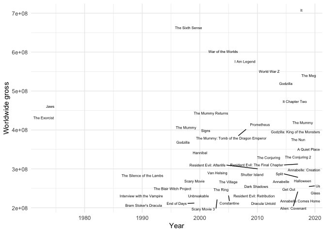

Did someone say Halloween?


**NOT MY IMAGE. THE FINE FOLKS AT PARAMOUNT OWN IT\!**

## Scraping Data Halloween Testing

Since we are rolling up on the spookiest holiday – Halloween, it might
be worth pulling in some data on horror movies. Not surprisingly,
Wikipedia has some information about the top-grossing horror movies of
all time.

``` r
library(data.table)
library(ggplot2)
library(knitr)
library(kableExtra)
library(rvest)

topGrossingLink <- 
  "https://en.wikipedia.org/wiki/List_of_highest-grossing_horror_films"

horrorMovies <- read_html(topGrossingLink) %>% 
  html_table(fill = TRUE) %>% 
  `[[`(1)

kable_material(kable(horrorMovies), 
               c("striped", "hover"))
```

<table class=" lightable-material lightable-striped lightable-hover" style='font-family: "Source Sans Pro", helvetica, sans-serif; margin-left: auto; margin-right: auto;'>

<thead>

<tr>

<th style="text-align:right;">

Rank

</th>

<th style="text-align:left;">

Film

</th>

<th style="text-align:left;">

Worldwide gross

</th>

<th style="text-align:right;">

Year

</th>

<th style="text-align:left;">

Franchise or basis

</th>

<th style="text-align:left;">

Studio

</th>

<th style="text-align:left;">

Ref

</th>

</tr>

</thead>

<tbody>

<tr>

<td style="text-align:right;">

1

</td>

<td style="text-align:left;">

It

</td>

<td style="text-align:left;">

$700,381,748

</td>

<td style="text-align:right;">

2017

</td>

<td style="text-align:left;">

It

</td>

<td style="text-align:left;">

New Line Cinema

</td>

<td style="text-align:left;">

\[1\]

</td>

</tr>

<tr>

<td style="text-align:right;">

2

</td>

<td style="text-align:left;">

The Sixth Sense

</td>

<td style="text-align:left;">

$672,806,292

</td>

<td style="text-align:right;">

1999

</td>

<td style="text-align:left;">

N/A

</td>

<td style="text-align:left;">

Hollywood Pictures

</td>

<td style="text-align:left;">

\[2\]

</td>

</tr>

<tr>

<td style="text-align:right;">

3

</td>

<td style="text-align:left;">

War of the Worlds

</td>

<td style="text-align:left;">

$591,745,540

</td>

<td style="text-align:right;">

2005

</td>

<td style="text-align:left;">

The War of the Worlds

</td>

<td style="text-align:left;">

Amblin Entertainment

</td>

<td style="text-align:left;">

\[3\]

</td>

</tr>

<tr>

<td style="text-align:right;">

4

</td>

<td style="text-align:left;">

I Am Legend

</td>

<td style="text-align:left;">

$585,349,010

</td>

<td style="text-align:right;">

2007

</td>

<td style="text-align:left;">

I Am Legend

</td>

<td style="text-align:left;">

Village Roadshow Pictures

</td>

<td style="text-align:left;">

\[4\]

</td>

</tr>

<tr>

<td style="text-align:right;">

5

</td>

<td style="text-align:left;">

World War Z

</td>

<td style="text-align:left;">

$540,007,876

</td>

<td style="text-align:right;">

2013

</td>

<td style="text-align:left;">

World War Z

</td>

<td style="text-align:left;">

Skydance Productions

</td>

<td style="text-align:left;">

\[5\]

</td>

</tr>

<tr>

<td style="text-align:right;">

6

</td>

<td style="text-align:left;">

The Meg

</td>

<td style="text-align:left;">

$530,243,742

</td>

<td style="text-align:right;">

2018

</td>

<td style="text-align:left;">

The Meg

</td>

<td style="text-align:left;">

Warner Bros. Pictures

</td>

<td style="text-align:left;">

\[6\]

</td>

</tr>

<tr>

<td style="text-align:right;">

7

</td>

<td style="text-align:left;">

Godzilla

</td>

<td style="text-align:left;">

$529,076,069

</td>

<td style="text-align:right;">

2014

</td>

<td style="text-align:left;">

Godzilla

</td>

<td style="text-align:left;">

Legendary Pictures

</td>

<td style="text-align:left;">

\[7\]

</td>

</tr>

<tr>

<td style="text-align:right;">

8

</td>

<td style="text-align:left;">

It Chapter Two

</td>

<td style="text-align:left;">

$473,093,228

</td>

<td style="text-align:right;">

2019

</td>

<td style="text-align:left;">

It

</td>

<td style="text-align:left;">

Warner Bros. Pictures

</td>

<td style="text-align:left;">

\[8\]

</td>

</tr>

<tr>

<td style="text-align:right;">

9

</td>

<td style="text-align:left;">

Jaws

</td>

<td style="text-align:left;">

$470,653,000

</td>

<td style="text-align:right;">

1975

</td>

<td style="text-align:left;">

Jaws

</td>

<td style="text-align:left;">

Universal Pictures

</td>

<td style="text-align:left;">

\[9\]

</td>

</tr>

<tr>

<td style="text-align:right;">

10

</td>

<td style="text-align:left;">

The Exorcist

</td>

<td style="text-align:left;">

$441,306,145

</td>

<td style="text-align:right;">

1973

</td>

<td style="text-align:left;">

The Exorcist

</td>

<td style="text-align:left;">

Hoya Productions

</td>

<td style="text-align:left;">

\[10\]

</td>

</tr>

<tr>

<td style="text-align:right;">

11

</td>

<td style="text-align:left;">

The Mummy Returns

</td>

<td style="text-align:left;">

$433,013,274

</td>

<td style="text-align:right;">

2001

</td>

<td style="text-align:left;">

The Mummy

</td>

<td style="text-align:left;">

Universal Pictures

</td>

<td style="text-align:left;">

\[11\]

</td>

</tr>

<tr>

<td style="text-align:right;">

12

</td>

<td style="text-align:left;">

The Mummy

</td>

<td style="text-align:left;">

$415,933,406

</td>

<td style="text-align:right;">

1999

</td>

<td style="text-align:left;">

The Mummy

</td>

<td style="text-align:left;">

Universal Pictures

</td>

<td style="text-align:left;">

\[12\]

</td>

</tr>

<tr>

<td style="text-align:right;">

13

</td>

<td style="text-align:left;">

The Mummy

</td>

<td style="text-align:left;">

$409,231,607

</td>

<td style="text-align:right;">

2017

</td>

<td style="text-align:left;">

The Mummy

</td>

<td style="text-align:left;">

Universal Pictures

</td>

<td style="text-align:left;">

\[13\]

</td>

</tr>

<tr>

<td style="text-align:right;">

14

</td>

<td style="text-align:left;">

Signs

</td>

<td style="text-align:left;">

$408,247,917

</td>

<td style="text-align:right;">

2002

</td>

<td style="text-align:left;">

N/A

</td>

<td style="text-align:left;">

Blinding Edge Pictures

</td>

<td style="text-align:left;">

\[14\]

</td>

</tr>

<tr>

<td style="text-align:right;">

15

</td>

<td style="text-align:left;">

Prometheus

</td>

<td style="text-align:left;">

$403,354,469

</td>

<td style="text-align:right;">

2012

</td>

<td style="text-align:left;">

Alien

</td>

<td style="text-align:left;">

Scott Free Productions

</td>

<td style="text-align:left;">

\[15\]

</td>

</tr>

<tr>

<td style="text-align:right;">

16

</td>

<td style="text-align:left;">

The Mummy: Tomb of the Dragon Emperor

</td>

<td style="text-align:left;">

$401,128,639

</td>

<td style="text-align:right;">

2008

</td>

<td style="text-align:left;">

The Mummy

</td>

<td style="text-align:left;">

Universal Pictures

</td>

<td style="text-align:left;">

\[16\]

</td>

</tr>

<tr>

<td style="text-align:right;">

17

</td>

<td style="text-align:left;">

Godzilla: King of the Monsters

</td>

<td style="text-align:left;">

$385,900,138

</td>

<td style="text-align:right;">

2019

</td>

<td style="text-align:left;">

Godzilla

</td>

<td style="text-align:left;">

Legendary Pictures

</td>

<td style="text-align:left;">

\[17\]

</td>

</tr>

<tr>

<td style="text-align:right;">

18

</td>

<td style="text-align:left;">

Godzilla

</td>

<td style="text-align:left;">

$379,014,294

</td>

<td style="text-align:right;">

1998

</td>

<td style="text-align:left;">

Godzilla

</td>

<td style="text-align:left;">

Centropolis Entertainment

</td>

<td style="text-align:left;">

\[18\]

</td>

</tr>

<tr>

<td style="text-align:right;">

19

</td>

<td style="text-align:left;">

The Nun

</td>

<td style="text-align:left;">

$365,550,119

</td>

<td style="text-align:right;">

2018

</td>

<td style="text-align:left;">

The Conjuring Universe

</td>

<td style="text-align:left;">

New Line Cinema

</td>

<td style="text-align:left;">

\[19\]

</td>

</tr>

<tr>

<td style="text-align:right;">

20

</td>

<td style="text-align:left;">

Hannibal

</td>

<td style="text-align:left;">

$351,692,268

</td>

<td style="text-align:right;">

2001

</td>

<td style="text-align:left;">

Hannibal Lecter

</td>

<td style="text-align:left;">

Dino De Laurentiis Company

</td>

<td style="text-align:left;">

\[20\]

</td>

</tr>

<tr>

<td style="text-align:right;">

21

</td>

<td style="text-align:left;">

A Quiet Place

</td>

<td style="text-align:left;">

$340,939,361

</td>

<td style="text-align:right;">

2018

</td>

<td style="text-align:left;">

N/A

</td>

<td style="text-align:left;">

Platinum Dunes

</td>

<td style="text-align:left;">

\[21\]

</td>

</tr>

<tr>

<td style="text-align:right;">

22

</td>

<td style="text-align:left;">

The Conjuring 2

</td>

<td style="text-align:left;">

$320,392,818

</td>

<td style="text-align:right;">

2016

</td>

<td style="text-align:left;">

The Conjuring Universe

</td>

<td style="text-align:left;">

New Line Cinema

</td>

<td style="text-align:left;">

\[19\]

</td>

</tr>

<tr>

<td style="text-align:right;">

23

</td>

<td style="text-align:left;">

The Conjuring

</td>

<td style="text-align:left;">

$319,494,638

</td>

<td style="text-align:right;">

2013

</td>

<td style="text-align:left;">

The Conjuring Universe

</td>

<td style="text-align:left;">

New Line Cinema

</td>

<td style="text-align:left;">

\[19\]

</td>

</tr>

<tr>

<td style="text-align:right;">

24

</td>

<td style="text-align:left;">

Resident Evil: The Final Chapter

</td>

<td style="text-align:left;">

$312,242,626

</td>

<td style="text-align:right;">

2017

</td>

<td style="text-align:left;">

Resident Evil

</td>

<td style="text-align:left;">

Constantin Film

</td>

<td style="text-align:left;">

\[22\]

</td>

</tr>

<tr>

<td style="text-align:right;">

25

</td>

<td style="text-align:left;">

Annabelle: Creation

</td>

<td style="text-align:left;">

$306,515,884

</td>

<td style="text-align:right;">

2017

</td>

<td style="text-align:left;">

The Conjuring Universe

</td>

<td style="text-align:left;">

New Line Cinema

</td>

<td style="text-align:left;">

\[19\]

</td>

</tr>

<tr>

<td style="text-align:right;">

26

</td>

<td style="text-align:left;">

Van Helsing

</td>

<td style="text-align:left;">

$300,257,475

</td>

<td style="text-align:right;">

2004

</td>

<td style="text-align:left;">

Dracula

</td>

<td style="text-align:left;">

Sommers Company / Stillking Films

</td>

<td style="text-align:left;">

\[23\]

</td>

</tr>

<tr>

<td style="text-align:right;">

27

</td>

<td style="text-align:left;">

Resident Evil: Afterlife

</td>

<td style="text-align:left;">

$300,228,084

</td>

<td style="text-align:right;">

2010

</td>

<td style="text-align:left;">

Resident Evil

</td>

<td style="text-align:left;">

Constantin Film

</td>

<td style="text-align:left;">

\[24\]

</td>

</tr>

<tr>

<td style="text-align:right;">

28

</td>

<td style="text-align:left;">

Shutter Island

</td>

<td style="text-align:left;">

$294,804,195

</td>

<td style="text-align:right;">

2010

</td>

<td style="text-align:left;">

Shutter Island

</td>

<td style="text-align:left;">

Phoenix Pictures

</td>

<td style="text-align:left;">

\[25\]

</td>

</tr>

<tr>

<td style="text-align:right;">

29

</td>

<td style="text-align:left;">

Split

</td>

<td style="text-align:left;">

$278,454,358

</td>

<td style="text-align:right;">

2017

</td>

<td style="text-align:left;">

Unbreakable

</td>

<td style="text-align:left;">

Blinding Edge Pictures

</td>

<td style="text-align:left;">

\[26\]

</td>

</tr>

<tr>

<td style="text-align:right;">

30

</td>

<td style="text-align:left;">

Scary Movie

</td>

<td style="text-align:left;">

$278,019,771

</td>

<td style="text-align:right;">

2000

</td>

<td style="text-align:left;">

Scary Movie

</td>

<td style="text-align:left;">

Dimension Films

</td>

<td style="text-align:left;">

\[27\]

</td>

</tr>

<tr>

<td style="text-align:right;">

31

</td>

<td style="text-align:left;">

The Silence of the Lambs

</td>

<td style="text-align:left;">

$272,742,922

</td>

<td style="text-align:right;">

1991

</td>

<td style="text-align:left;">

Clarice Starling

</td>

<td style="text-align:left;">

Strong Heart/Demme Production

</td>

<td style="text-align:left;">

\[28\]

</td>

</tr>

<tr>

<td style="text-align:right;">

32

</td>

<td style="text-align:left;">

Annabelle

</td>

<td style="text-align:left;">

$257,047,661

</td>

<td style="text-align:right;">

2014

</td>

<td style="text-align:left;">

The Conjuring Universe

</td>

<td style="text-align:left;">

New Line Cinema

</td>

<td style="text-align:left;">

\[19\]

</td>

</tr>

<tr>

<td style="text-align:right;">

33

</td>

<td style="text-align:left;">

The Village

</td>

<td style="text-align:left;">

$256,697,520

</td>

<td style="text-align:right;">

2004

</td>

<td style="text-align:left;">

N/A

</td>

<td style="text-align:left;">

Blinding Edge Pictures

</td>

<td style="text-align:left;">

\[29\]

</td>

</tr>

<tr>

<td style="text-align:right;">

34

</td>

<td style="text-align:left;">

Halloween

</td>

<td style="text-align:left;">

$255,498,536

</td>

<td style="text-align:right;">

2018

</td>

<td style="text-align:left;">

Halloween

</td>

<td style="text-align:left;">

Blumhouse Productions

</td>

<td style="text-align:left;">

\[30\]

</td>

</tr>

<tr>

<td style="text-align:right;">

35

</td>

<td style="text-align:left;">

Get Out

</td>

<td style="text-align:left;">

$255,407,663

</td>

<td style="text-align:right;">

2017

</td>

<td style="text-align:left;">

N/A

</td>

<td style="text-align:left;">

Blumhouse Productions

</td>

<td style="text-align:left;">

\[31\]

</td>

</tr>

<tr>

<td style="text-align:right;">

36

</td>

<td style="text-align:left;">

Us

</td>

<td style="text-align:left;">

$254,732,150

</td>

<td style="text-align:right;">

2019

</td>

<td style="text-align:left;">

N/A

</td>

<td style="text-align:left;">

Monkeypaw Productions

</td>

<td style="text-align:left;">

\[32\]

</td>

</tr>

<tr>

<td style="text-align:right;">

37

</td>

<td style="text-align:left;">

The Blair Witch Project

</td>

<td style="text-align:left;">

$248,639,099

</td>

<td style="text-align:right;">

1999

</td>

<td style="text-align:left;">

Blair Witch

</td>

<td style="text-align:left;">

Haxan Films

</td>

<td style="text-align:left;">

\[33\]

</td>

</tr>

<tr>

<td style="text-align:right;">

38

</td>

<td style="text-align:left;">

The Ring

</td>

<td style="text-align:left;">

$248,218,486

</td>

<td style="text-align:right;">

2002

</td>

<td style="text-align:left;">

The Ring

</td>

<td style="text-align:left;">

DreamWorks Pictures

</td>

<td style="text-align:left;">

\[34\]

</td>

</tr>

<tr>

<td style="text-align:right;">

39

</td>

<td style="text-align:left;">

Unbreakable

</td>

<td style="text-align:left;">

$248,118,121

</td>

<td style="text-align:right;">

2000

</td>

<td style="text-align:left;">

Unbreakable

</td>

<td style="text-align:left;">

Blinding Edge Pictures

</td>

<td style="text-align:left;">

\[35\]

</td>

</tr>

<tr>

<td style="text-align:right;">

40

</td>

<td style="text-align:left;">

Glass

</td>

<td style="text-align:left;">

$246,985,576

</td>

<td style="text-align:right;">

2019

</td>

<td style="text-align:left;">

Unbreakable

</td>

<td style="text-align:left;">

Blinding Edge Pictures

</td>

<td style="text-align:left;">

\[36\]

</td>

</tr>

<tr>

<td style="text-align:right;">

41

</td>

<td style="text-align:left;">

Dark Shadows

</td>

<td style="text-align:left;">

$245,527,149

</td>

<td style="text-align:right;">

2012

</td>

<td style="text-align:left;">

Dark Shadows

</td>

<td style="text-align:left;">

Village Roadshow Pictures

</td>

<td style="text-align:left;">

\[37\]

</td>

</tr>

<tr>

<td style="text-align:right;">

42

</td>

<td style="text-align:left;">

Alien: Covenant

</td>

<td style="text-align:left;">

$240,891,763

</td>

<td style="text-align:right;">

2017

</td>

<td style="text-align:left;">

Alien

</td>

<td style="text-align:left;">

20th Century Fox

</td>

<td style="text-align:left;">

\[38\]

</td>

</tr>

<tr>

<td style="text-align:right;">

43

</td>

<td style="text-align:left;">

Resident Evil: Retribution

</td>

<td style="text-align:left;">

$240,004,424

</td>

<td style="text-align:right;">

2012

</td>

<td style="text-align:left;">

Resident Evil

</td>

<td style="text-align:left;">

Constantin Film

</td>

<td style="text-align:left;">

\[39\]

</td>

</tr>

<tr>

<td style="text-align:right;">

44

</td>

<td style="text-align:left;">

Constantine

</td>

<td style="text-align:left;">

$230,884,728

</td>

<td style="text-align:right;">

2005

</td>

<td style="text-align:left;">

Hellblazer

</td>

<td style="text-align:left;">

Warner Bros. Pictures

</td>

<td style="text-align:left;">

\[40\]

</td>

</tr>

<tr>

<td style="text-align:right;">

45

</td>

<td style="text-align:left;">

Annabelle Comes Home

</td>

<td style="text-align:left;">

$228,552,591

</td>

<td style="text-align:right;">

2019

</td>

<td style="text-align:left;">

The Conjuring Universe

</td>

<td style="text-align:left;">

New Line Cinema

</td>

<td style="text-align:left;">

\[41\]

</td>

</tr>

<tr>

<td style="text-align:right;">

46

</td>

<td style="text-align:left;">

Interview with the Vampire

</td>

<td style="text-align:left;">

$223,664,608

</td>

<td style="text-align:right;">

1994

</td>

<td style="text-align:left;">

The Vampire Chronicles

</td>

<td style="text-align:left;">

The Geffen Film Company

</td>

<td style="text-align:left;">

\[42\]

</td>

</tr>

<tr>

<td style="text-align:right;">

47

</td>

<td style="text-align:left;">

Scary Movie 3

</td>

<td style="text-align:left;">

$220,673,217

</td>

<td style="text-align:right;">

2003

</td>

<td style="text-align:left;">

Scary Movie

</td>

<td style="text-align:left;">

Dimension Films

</td>

<td style="text-align:left;">

\[43\]

</td>

</tr>

<tr>

<td style="text-align:right;">

48

</td>

<td style="text-align:left;">

Dracula Untold

</td>

<td style="text-align:left;">

$217,124,280

</td>

<td style="text-align:right;">

2014

</td>

<td style="text-align:left;">

Dracula

</td>

<td style="text-align:left;">

Universal Pictures

</td>

<td style="text-align:left;">

\[44\]

</td>

</tr>

<tr>

<td style="text-align:right;">

49

</td>

<td style="text-align:left;">

Bram Stoker’s Dracula

</td>

<td style="text-align:left;">

$215,862,692

</td>

<td style="text-align:right;">

1992

</td>

<td style="text-align:left;">

Dracula

</td>

<td style="text-align:left;">

American Zoetrope

</td>

<td style="text-align:left;">

\[45\]

</td>

</tr>

<tr>

<td style="text-align:right;">

50

</td>

<td style="text-align:left;">

End of Days

</td>

<td style="text-align:left;">

$211,989,043

</td>

<td style="text-align:right;">

1999

</td>

<td style="text-align:left;">

N/A

</td>

<td style="text-align:left;">

Beacon Pictures

</td>

<td style="text-align:left;">

\[46\]

</td>

</tr>

</tbody>

</table>

As per usual, we will likely need to clean some of those dollar values
up just a little bit:

``` r
horrorMovies$`Worldwide gross` <- gsub("\\$|,", 
                                       "", 
                                       horrorMovies$`Worldwide gross`)

horrorMovies$`Worldwide gross` <- as.numeric(horrorMovies$`Worldwide gross`)
```

All looks good now\!

<table style='width: auto;'
        class='table table-condensed'>

<caption>

Data summary

</caption>

<thead>

<tr>

<th style="text-align:left;">

</th>

<th style="text-align:left;">

</th>

</tr>

</thead>

<tbody>

<tr>

<td style="text-align:left;">

Name

</td>

<td style="text-align:left;">

horrorMovies$Worldwide gr…

</td>

</tr>

<tr>

<td style="text-align:left;">

Number of rows

</td>

<td style="text-align:left;">

50

</td>

</tr>

<tr>

<td style="text-align:left;">

Number of columns

</td>

<td style="text-align:left;">

1

</td>

</tr>

<tr>

<td style="text-align:left;">

\_\_\_\_\_\_\_\_\_\_\_\_\_\_\_\_\_\_\_\_\_\_\_

</td>

<td style="text-align:left;">

</td>

</tr>

<tr>

<td style="text-align:left;">

Column type frequency:

</td>

<td style="text-align:left;">

</td>

</tr>

<tr>

<td style="text-align:left;">

numeric

</td>

<td style="text-align:left;">

1

</td>

</tr>

<tr>

<td style="text-align:left;">

\_\_\_\_\_\_\_\_\_\_\_\_\_\_\_\_\_\_\_\_\_\_\_\_

</td>

<td style="text-align:left;">

</td>

</tr>

<tr>

<td style="text-align:left;">

Group variables

</td>

<td style="text-align:left;">

None

</td>

</tr>

</tbody>

</table>

**Variable type: numeric**

<table>

<thead>

<tr>

<th style="text-align:left;">

skim\_variable

</th>

<th style="text-align:right;">

n\_missing

</th>

<th style="text-align:right;">

complete\_rate

</th>

<th style="text-align:right;">

mean

</th>

<th style="text-align:right;">

sd

</th>

<th style="text-align:right;">

p0

</th>

<th style="text-align:right;">

p25

</th>

<th style="text-align:right;">

p50

</th>

<th style="text-align:right;">

p75

</th>

<th style="text-align:right;">

p100

</th>

<th style="text-align:left;">

hist

</th>

</tr>

</thead>

<tbody>

<tr>

<td style="text-align:left;">

data

</td>

<td style="text-align:right;">

0

</td>

<td style="text-align:right;">

1

</td>

<td style="text-align:right;">

347166804

</td>

<td style="text-align:right;">

125496259

</td>

<td style="text-align:right;">

211989043

</td>

<td style="text-align:right;">

248323639

</td>

<td style="text-align:right;">

303386680

</td>

<td style="text-align:right;">

408985684

</td>

<td style="text-align:right;">

700381748

</td>

<td style="text-align:left;">

▇▃▂▂▁

</td>

</tr>

</tbody>

</table>

Which studios tend to do well with making money off horror?

``` r
horrorMovies <- as.data.table(horrorMovies)

sortedStudio <- horrorMovies[, 
                             .(average = mean(`Worldwide gross`)), 
                             by = Studio][order(-average)]

kable_material(kable(sortedStudio), 
               c("striped", "hover"))
```

<table class=" lightable-material lightable-striped lightable-hover" style='font-family: "Source Sans Pro", helvetica, sans-serif; margin-left: auto; margin-right: auto;'>

<thead>

<tr>

<th style="text-align:left;">

Studio

</th>

<th style="text-align:right;">

average

</th>

</tr>

</thead>

<tbody>

<tr>

<td style="text-align:left;">

Hollywood Pictures

</td>

<td style="text-align:right;">

672806292

</td>

</tr>

<tr>

<td style="text-align:left;">

Amblin Entertainment

</td>

<td style="text-align:right;">

591745540

</td>

</tr>

<tr>

<td style="text-align:left;">

Skydance Productions

</td>

<td style="text-align:right;">

540007876

</td>

</tr>

<tr>

<td style="text-align:left;">

Legendary Pictures

</td>

<td style="text-align:right;">

457488104

</td>

</tr>

<tr>

<td style="text-align:left;">

Hoya Productions

</td>

<td style="text-align:right;">

441306145

</td>

</tr>

<tr>

<td style="text-align:left;">

Village Roadshow Pictures

</td>

<td style="text-align:right;">

415438080

</td>

</tr>

<tr>

<td style="text-align:left;">

Warner Bros. Pictures

</td>

<td style="text-align:right;">

411407233

</td>

</tr>

<tr>

<td style="text-align:left;">

Scott Free Productions

</td>

<td style="text-align:right;">

403354469

</td>

</tr>

<tr>

<td style="text-align:left;">

Universal Pictures

</td>

<td style="text-align:right;">

391180701

</td>

</tr>

<tr>

<td style="text-align:left;">

Centropolis Entertainment

</td>

<td style="text-align:right;">

379014294

</td>

</tr>

<tr>

<td style="text-align:left;">

New Line Cinema

</td>

<td style="text-align:right;">

356847923

</td>

</tr>

<tr>

<td style="text-align:left;">

Dino De Laurentiis Company

</td>

<td style="text-align:right;">

351692268

</td>

</tr>

<tr>

<td style="text-align:left;">

Platinum Dunes

</td>

<td style="text-align:right;">

340939361

</td>

</tr>

<tr>

<td style="text-align:left;">

Sommers Company / Stillking Films

</td>

<td style="text-align:right;">

300257475

</td>

</tr>

<tr>

<td style="text-align:left;">

Phoenix Pictures

</td>

<td style="text-align:right;">

294804195

</td>

</tr>

<tr>

<td style="text-align:left;">

Blinding Edge Pictures

</td>

<td style="text-align:right;">

287700698

</td>

</tr>

<tr>

<td style="text-align:left;">

Constantin Film

</td>

<td style="text-align:right;">

284158378

</td>

</tr>

<tr>

<td style="text-align:left;">

Strong Heart/Demme Production

</td>

<td style="text-align:right;">

272742922

</td>

</tr>

<tr>

<td style="text-align:left;">

Blumhouse Productions

</td>

<td style="text-align:right;">

255453100

</td>

</tr>

<tr>

<td style="text-align:left;">

Monkeypaw Productions

</td>

<td style="text-align:right;">

254732150

</td>

</tr>

<tr>

<td style="text-align:left;">

Dimension Films

</td>

<td style="text-align:right;">

249346494

</td>

</tr>

<tr>

<td style="text-align:left;">

Haxan Films

</td>

<td style="text-align:right;">

248639099

</td>

</tr>

<tr>

<td style="text-align:left;">

DreamWorks Pictures

</td>

<td style="text-align:right;">

248218486

</td>

</tr>

<tr>

<td style="text-align:left;">

20th Century Fox

</td>

<td style="text-align:right;">

240891763

</td>

</tr>

<tr>

<td style="text-align:left;">

The Geffen Film Company

</td>

<td style="text-align:right;">

223664608

</td>

</tr>

<tr>

<td style="text-align:left;">

American Zoetrope

</td>

<td style="text-align:right;">

215862692

</td>

</tr>

<tr>

<td style="text-align:left;">

Beacon Pictures

</td>

<td style="text-align:right;">

211989043

</td>

</tr>

</tbody>

</table>

## Plotting Data

Just for the fun of it, let’s do some plotting over the years:

``` r
ggplot(horrorMovies, aes(x = Year, y = `Worldwide gross`, label = Film)) +
  ggrepel::geom_text_repel(size = 2) +
  theme_minimal()
```

<!-- -->

``` r
# If you want to get fancy with plotly, that
# code is below:

# plot_ly(horrorMovies, x = ~Year, y = ~`Worldwide gross`,
#         type = "scatter", mode = "markers",
#         text = ~paste("Film: ", Film, '<br>Studio: ', Studio, sep = ""))
```

We saw some averages for the studios earlier, so let’s get a better idea
about each studios distribution within the list:

``` r
ggplot(horrorMovies, aes(x = `Worldwide gross`, y = Studio)) +
  geom_boxplot() + 
  theme_minimal()
```

<!-- -->

``` r
# plot_ly(horrorMovies, x = ~`Worldwide gross`, y = ~Studio, 
#         type = "box")
```

## Relationship Exploration

Let’s see if we can get into any relationships between movie information
and money.

We can load in our `horrorOut` data:

``` r
load("data/horrorOut.RData")
```

And join it with our highest-grossing data:

``` r
horrorOut$Year <- as.integer(horrorOut$Year)

allData <- merge.data.table(horrorMovies, horrorOut, 
                            by.x = c("Film", "Year"), 
                            by.y = c("Title", "Year"))
dim(allData)
```

    [1] 48 32

It looks like we lost a few movies\!

I suppose you never know what might be creeping around with your data
until you try to work with it\!


``` r
horrorMovies$Film[!horrorMovies$Film %in% horrorOut$Title]
```

``` 
[1] "Resident Evil: The Final Chapter" "Interview with the Vampire"      
```

``` r
horrorOut$Title[!horrorMovies$Film %in% horrorOut$Title]
```

    [1] "Resident Evil the Final Chapter: Explore the Hive" 
    [2] "Interview with the Vampire: The Vampire Chronicles"

That’s just silly…but since it is just a few, we won’t worry about a
fuzzy join.

``` r
horrorMovies$Film[
  horrorMovies$Film == "Resident Evil: The Final Chapter"
  ] <- "Resident Evil the Final Chapter: Explore the Hive"

horrorMovies$Film[
  horrorMovies$Film == "Interview with the Vampire"
  ] <- "Interview with the Vampire: The Vampire Chronicles"
```

Now, we should be set to join:

``` r
allData <- merge.data.table(horrorMovies, horrorOut, 
                            by.x = c("Film", "Year"), 
                            by.y = c("Title", "Year"))

dim(allData)
```

    [1] 50 32

As per usual, we will need to clean up some variables before we can use
them:

``` r
ratingVars <- c("Internet Movie Database", 
                "Metacritic", 
                "Rotten Tomatoes")

# We need to remove special characters in the ratings columns:

allData[, 
        (ratingVars) := lapply(.SD, function(x) {
          as.numeric(gsub("/[0-1]+|%", "", x))
        }), 
        .SDcols = ratingVars]

# And let's multiply IMDB by 10 to put it on the same scale as the others:

allData$`Internet Movie Database` <- allData$`Internet Movie Database` * 10
```

Let’s check on some correlations between the ratings and gross:

``` r
corData <- allData[, 
                   .(`Worldwide gross`, `Internet Movie Database`, 
                     Metacritic, `Rotten Tomatoes`)]

GGally::ggcorr(corData)
```

<!-- -->

There are a few frequent fliers on this list, so let’s see how those
folks typically do:

``` r
repeatedDirectors <- unique(allData$Director[duplicated(allData$Director)])

repeatDirectorData <- allData[Director %in% repeatedDirectors, ]
```

Absolutely wild that 9 people account for about half of the top 50
money-wise, but what about quality?

``` r
plotData <- melt.data.table(
  repeatDirectorData[, 
                     .(Director, `Rotten Tomatoes`, 
                       Metacritic, `Internet Movie Database`)], 
  id.vars = "Director", 
  measure.vars = c("Rotten Tomatoes", 
                   "Metacritic", "Internet Movie Database"))

ggplot(plotData, 
       aes(x = value, y = Director, color = variable)) + 
  geom_boxplot() +
  theme_minimal()
```

<!-- -->

Seems like Jordan Peele’s brand of socially-drive horror is quality.

Which movies are “Fresh”?

``` r
allData[`Rotten Tomatoes` > 69, list(Film, `Rotten Tomatoes`)]
```

``` 
                        Film Rotten Tomatoes
 1:            A Quiet Place              96
 2:      Annabelle: Creation              71
 3:    Bram Stoker's Dracula              71
 4:                  Get Out              98
 5:                 Godzilla              76
 6:                Halloween              79
 7:                       It              85
 8:                     Jaws              98
 9:               Prometheus              73
10:                    Signs              74
11:  The Blair Witch Project              86
12:            The Conjuring              86
13:          The Conjuring 2              80
14:             The Exorcist              83
15:                 The Ring              71
16: The Silence of the Lambs              96
17:          The Sixth Sense              86
18:              Unbreakable              70
19:                       Us              93
20:        War of the Worlds              75
```

And then “Rotten”?

``` r
allData[`Rotten Tomatoes` < 70, list(Film, `Rotten Tomatoes`)]
```

``` 
                                                  Film Rotten Tomatoes
 1:                                    Alien: Covenant              65
 2:                                          Annabelle              29
 3:                               Annabelle Comes Home              64
 4:                                        Constantine              46
 5:                                       Dark Shadows              36
 6:                                     Dracula Untold              24
 7:                                        End of Days              11
 8:                                              Glass              37
 9:                                           Godzilla              15
10:                     Godzilla: King of the Monsters              43
11:                                           Hannibal              39
12:                                        I Am Legend              68
13: Interview with the Vampire: The Vampire Chronicles              63
14:                                     It Chapter Two              64
15:                           Resident Evil: Afterlife              22
16:                         Resident Evil: Retribution              29
17:                                        Scary Movie              53
18:                                      Scary Movie 3              35
19:                                     Shutter Island              68
20:                                            The Meg              46
21:                                          The Mummy              61
22:                                          The Mummy              16
23:                                  The Mummy Returns              47
24:              The Mummy: Tomb of the Dragon Emperor              12
25:                                            The Nun              25
26:                                        The Village              43
27:                                        World War Z              66
                                                  Film Rotten Tomatoes
```

Let’s see what a regression might get us:

``` r
rtGross <- lm(`Worldwide gross` ~ `Rotten Tomatoes`, 
              data = allData)
```

<table style="text-align:center">

<tr>

<td colspan="2" style="border-bottom: 1px solid black">

</td>

</tr>

<tr>

<td style="text-align:left">

</td>

<td>

<em>Dependent variable:</em>

</td>

</tr>

<tr>

<td>

</td>

<td colspan="1" style="border-bottom: 1px solid black">

</td>

</tr>

<tr>

<td style="text-align:left">

</td>

<td>

`Worldwide gross`

</td>

</tr>

<tr>

<td colspan="2" style="border-bottom: 1px solid black">

</td>

</tr>

<tr>

<td style="text-align:left">

`Rotten Tomatoes`

</td>

<td>

1,145,341.000

</td>

</tr>

<tr>

<td style="text-align:left">

</td>

<td>

(733,234.700)

</td>

</tr>

<tr>

<td style="text-align:left">

</td>

<td>

</td>

</tr>

<tr>

<td style="text-align:left">

Constant

</td>

<td>

282,770,429.000<sup>\*\*\*</sup>

</td>

</tr>

<tr>

<td style="text-align:left">

</td>

<td>

(47,064,788.000)

</td>

</tr>

<tr>

<td style="text-align:left">

</td>

<td>

</td>

</tr>

<tr>

<td colspan="2" style="border-bottom: 1px solid black">

</td>

</tr>

<tr>

<td style="text-align:left">

Observations

</td>

<td>

47

</td>

</tr>

<tr>

<td style="text-align:left">

R<sup>2</sup>

</td>

<td>

0.051

</td>

</tr>

<tr>

<td style="text-align:left">

Adjusted R<sup>2</sup>

</td>

<td>

0.030

</td>

</tr>

<tr>

<td style="text-align:left">

Residual Std. Error

</td>

<td>

126,828,366.000 (df = 45)

</td>

</tr>

<tr>

<td style="text-align:left">

F Statistic

</td>

<td>

2.440 (df = 1; 45)

</td>

</tr>

<tr>

<td colspan="2" style="border-bottom: 1px solid black">

</td>

</tr>

<tr>

<td style="text-align:left">

<em>Note:</em>

</td>

<td style="text-align:right">

<sup>*</sup>p\<0.1; <sup>**</sup>p\<0.05; <sup>***</sup>p\<0.01

</td>

</tr>

</table>

## Top 100

``` r
top100Link <- "https://www.rottentomatoes.com/top/bestofrt/top_100_horror_movies/"

allTables <- read_html(top100Link) %>% 
  html_table() 
  
tableNames <- lapply(allTables, function(x) names(x))

tableNumber <- grep("Rank", tableNames)

top100Table <- allTables[[tableNumber]]

top100Table$Title <- gsub("\\s\\(.*[0-9]{4}\\)$", "", top100Table$Title)

allData$Film[allData$Film %in% top100Table$Title]
```

``` 
 [1] "A Quiet Place"            "Get Out"                 
 [3] "Godzilla"                 "Godzilla"                
 [5] "Halloween"                "It"                      
 [7] "The Blair Witch Project"  "The Conjuring"           
 [9] "The Mummy"                "The Mummy"               
[11] "The Silence of the Lambs" "Us"                      
```

Cool stuff.
